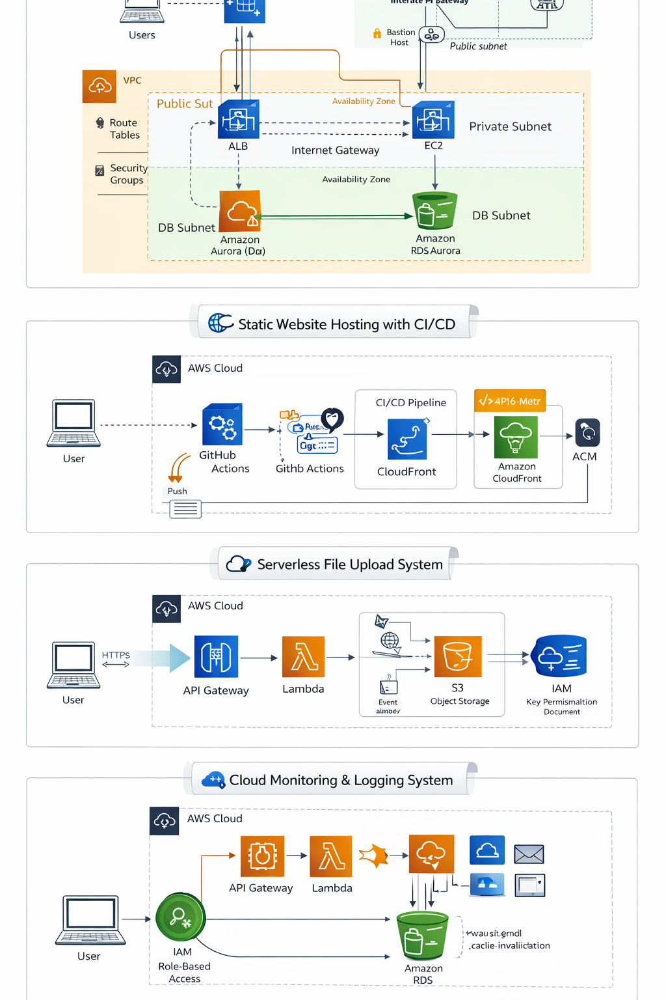

# 👋 Hi, I'm Gaurav

### ☁️ Cloud & DevOps Engineer | AWS | CI/CD | Terraform

🚀 Cloud Engineer with **3+ years of networking experience**, focused on building **secure, scalable, and cost-efficient cloud infrastructure on AWS**.

---

## ⚡ What I Do

* 🔹 Design **production-grade cloud architectures (3-tier, serverless)**
* 🔹 Build and automate **CI/CD pipelines**
* 🔹 Implement **Infrastructure as Code (Terraform)**
* 🔹 Optimize **cost, performance, and security**
* 🔹 Bridge **networking fundamentals with cloud-native systems**

---

## 🛠 Tech Stack

**Cloud:** AWS
**IaC:** Terraform, CloudFormation  
**CI/CD:** GitHub Actions
---

## 🚀 Featured Projects

### 🔹 AWS 3-Tier Architecture

✔ Secure VPC with public/private subnets
✔ Isolated web, app, and DB layers
✔ IAM least privilege implementation
✔ Cost-optimized architecture

🔗 Repo:(https://github.com/Gauarv146/aws-3tier-architecture-ec2-rds-alb)

---

### 🔹 Static Website Hosting with CI/CD

✔ S3 + CloudFront deployment
✔ GitHub Actions CI/CD automation
✔ HTTPS with ACM
✔ Cache invalidation for real-time updates

🔗 Repo: (https://github.com/Gauarv146/aws-static-website-s3-cloudfront-cicd)
🌍 Live:(http://cloud-portfolio-static-website.s3-website.ap-south-1.amazonaws.com/)

---

### 🔹 Serverless File Upload System

✔ API Gateway + Lambda + S3
✔ Event-driven architecture
✔ Secure IAM role-based access

🔗 Repo: (https://github.com/Gauarv146/aws-serverless-file-upload-lambda-apigateway)

---

### 🔹 Cloud Monitoring & Logging System

✔ CloudWatch + SNS alerts
✔ Real-time monitoring pipeline
✔ Centralized logging

🔗 Repo: (https://github.com/Gauarv146/aws-cloud-monitoring-system-cloudwatch-sns)

---

## 📊 Impact & Achievements

* - Reduced deployment effort by ~90% using CI/CD automation
* 💰 Designed solutions within **AWS Free Tier (cost optimized)**
* 🚀 Improved application delivery speed using CI/CD
* 🔐 Implemented secure IAM and network architecture

---

### 🔹 AWS Architecture Overview

## 📜 Certifications 

* AWS Certified Solutions Architect – Associate

---

## 🌐 Connect With Me

* 💼 LinkedIn: https://linkedin.com/in/gaurav-kumar-165391203
* 📧 Email: [gaurav.cloud46@gmail.com](mailto:gaurav.cloud46@gmail.com)

---

## ⚡ Profile Vision

Building scalable, secure, and automated cloud systems aligned with real-world production standards.
